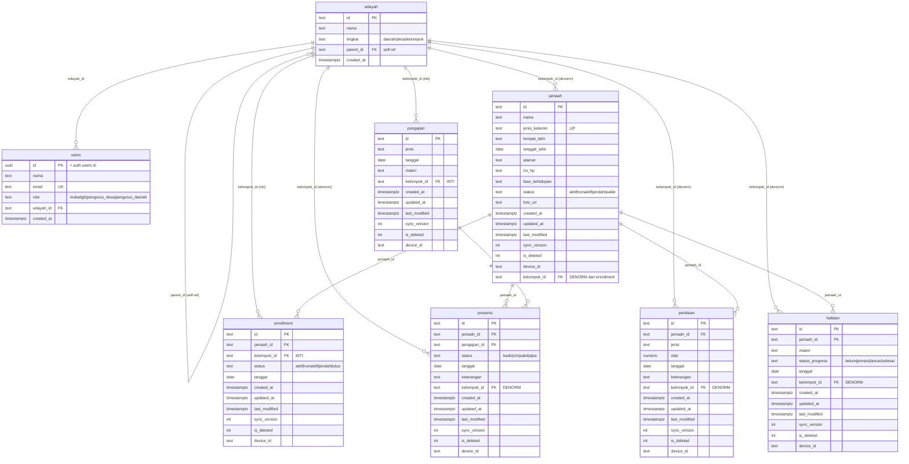

# ERD — Skema Database PPG (Migrasi 0001)

Diagram relasi entitas untuk PPG (Pembinaan Generasi Penerus). Sumber kebenaran
skema: [`migrations/0001_init_schema.sql`](./migrations/0001_init_schema.sql).

## Diagram

## Catatan relasi & keputusan

1. **Hierarki wilayah** self-referencing: `daerah → desa → kelompok` lewat
   `parent_id`. Semua data terikat ke `kelompok` (tingkat terbawah).
2. **`enrollment` = sumber kebenaran** kepemilikan kelompok. Dijamin **satu
   enrollment aktif per jamaah** via index unik parsial `uq_enrollment_aktif`.
3. **`kelompok_id` denormalisasi** pada `jamaah`, `presensi`, `penilaian`,
   `hafalan` — diisi otomatis oleh trigger dari enrollment aktif. Dipakai RLS
   (P0.3) untuk filter cepat tanpa join ke enrollment.
4. **`kelompok_id` inti** pada `enrollment` dan `pengajian` (bukan denormalisasi).
5. **Trigger**:
   - `fn_touch_row` — naikkan `sync_version`, set `updated_at`/`last_modified`
     saat UPDATE (semua tabel data).
   - `fn_set_kelompok_jamaah` / `fn_set_kelompok_by_jamaah` — isi `kelompok_id`
     denormalisasi saat INSERT/UPDATE.
   - `fn_propagasi_kelompok_enrollment` — saat enrollment berubah, sebarkan
     `kelompok_id` ke jamaah dan turunannya (mengatasi urutan insert).
6. **View `v_rekap_kelompok`** — agregasi per kelompok: jumlah jamaah aktif,
   total/persentase kehadiran, dan progress hafalan.
7. **RLS belum aktif** — diatur pada migrasi berikutnya (P0.3).

## Verifikasi

Migrasi sudah dijalankan pada PostgreSQL 16 lokal tanpa error, dan alur trigger
(propagasi kelompok, kenaikan `sync_version`, perpindahan kelompok, batasan
enrollment aktif tunggal) sudah diuji fungsional.
